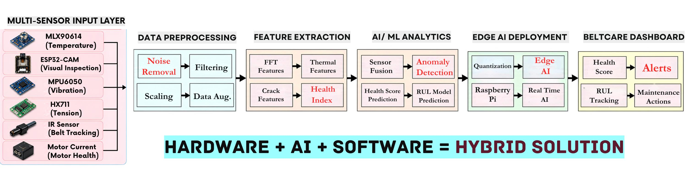
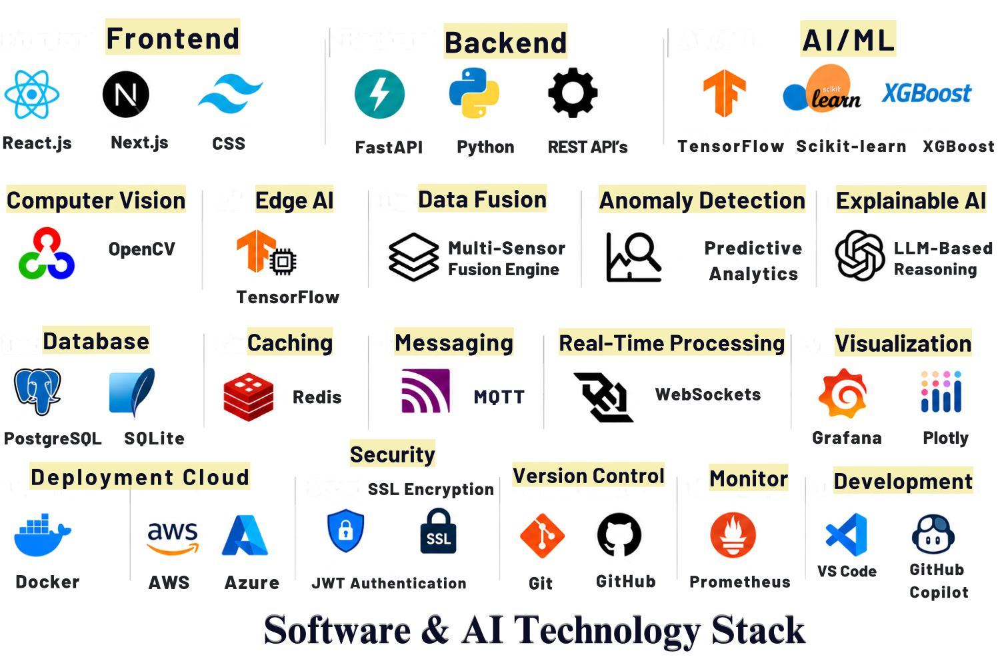

<div align="center">

# 🚀 BeltCare

### AI-Powered Structural Health Monitoring & Predictive Maintenance System for Conveyor Belts

**Smart India Hackathon 2026 • SIH26008 • Smart Automation • Hardware**

<br>

[]()
[]()
[]()
[]()
[]()
[]()
[]()

## 🇮🇳 Smart India Hackathon 2026

| | Details |
|---|---|
| **Problem Statement ID** | SIH26008 |
| **Problem Statement** | Belt Joint Rupture and Conveyor Belt Damages in Iron Ore Mining Industry |
| **Theme** | Smart Automation |
| **Category** | Hardware |
| **Team** | Teen Titans |
| **Team ID** | 181546 |
| **Solution Type** | Hardware + Edge AI + IoT + Software |


</div>

## 🧩 CAD Model

<p align="center">
  
</p>

# 🎯 Executive Summary

**BeltCare** is a hybrid **Hardware + AI + IoT + Software** platform designed for continuous monitoring and predictive maintenance of conveyor belts and belt joints used in mining and bulk-material handling.

Traditional conveyor maintenance is largely manual, periodic, reactive, or schedule-based. This creates a gap between the time when degradation begins and the time when it becomes visible or causes a failure.

BeltCare addresses this gap by combining:

- 🌡️ Thermal sensing
- 📳 Vibration monitoring
- 🎙️ Acoustic sensing
- ⚖️ Load and tension monitoring
- 📍 Belt tracking
- 📷 Computer vision
- ⚡ Motor-health signals
- 🤖 Edge AI
- 🧠 Multi-sensor fusion
- 📊 Health scoring
- ⏳ Remaining Useful Life estimation
- 🔎 Explainable alerts
- 🔧 Maintenance recommendations

### Core Workflow

> **SENSE → FUSE → DETECT → PREDICT → EXPLAIN → ACT**

The objective is to move conveyor maintenance from:

**REACTIVE → CONDITION-BASED → PREDICTIVE**

---

# 🏭 The Problem

Conveyor belts are the backbone of material transportation in iron ore mining operations, connecting:

**Mining → Crushing → Screening → Stockyard → Dispatch**

Conveyor belt joints and belt surfaces continuously experience:

- High tension
- Heavy loads
- Repeated flexing
- Vibration
- Misalignment
- Dust
- Moisture
- Temperature variation
- Start-stop cycles
- Mechanical wear

These conditions can gradually lead to:

- Splice degradation
- Delamination
- Longitudinal tears
- Edge damage
- Mistracking
- Thermal abnormalities
- Excessive vibration
- Overload conditions
- Belt rupture

## 🤖 Why Current Practices Are Not Enough

| Existing Challenge | Consequence |
|---|---|
| Scheduled inspections | Damage can develop between inspections |
| Manual inspection | Labour intensive and difficult to scale |
| Reactive maintenance | Failure is detected after damage becomes critical |
| Single-sensor monitoring | Higher possibility of false alarms |
| Threshold-only systems | Limited context about degradation |
| Poor localization | Engineers may need to inspect large belt sections |
| Harsh environment | Dust, moisture and electrical noise affect sensing |
| Legacy infrastructure | Data remains isolated in PLC/SCADA systems |

### 🔎 The Core Question

Most conventional systems answer:

> **"Has a failure occurred?"**

BeltCare aims to answer:

> **"Where is degradation developing, how severe is it, and when should maintenance intervene?"**

---

# 💡 Our Solution

BeltCare introduces a **continuous, multi-sensor, edge-AI-driven conveyor health monitoring system**.

The system collects multiple physical signals from the conveyor and combines them to create a more reliable picture of asset health.

### BeltCare Pipeline

```text
┌──────────────────────────────────────────────────────────┐
│                    MULTI-SENSOR INPUT                    │
│                                                          │
│ Temperature • Vibration • Acoustic • Load • Tracking     │
│ Vision • Motor Health                                    │
└──────────────────────────┬───────────────────────────────┘
                           ↓
┌──────────────────────────────────────────────────────────┐
│                 DATA PREPROCESSING                       │
│                                                          │
│ Noise Removal • Filtering • Scaling • Synchronization    │
└──────────────────────────┬───────────────────────────────┘
                           ↓
┌──────────────────────────────────────────────────────────┐
│                  FEATURE EXTRACTION                      │
│                                                          │
│ FFT • RMS • Thermal Features • Acoustic Features         │
│ Tracking Features • Vision Features • Health Index       │
└──────────────────────────┬───────────────────────────────┘
                           ↓
┌──────────────────────────────────────────────────────────┐
│                    AI / ML ANALYTICS                     │
│                                                          │
│ Sensor Fusion • Anomaly Detection • Classification       │
│ Health Score • Degradation Modelling • RUL Prediction    │
└──────────────────────────┬───────────────────────────────┘
                           ↓
┌──────────────────────────────────────────────────────────┐
│                    EDGE AI LAYER                         │
│                                                          │
│ Raspberry Pi • Local Inference • Real-Time Processing    │
│ Local Alerts • Offline Monitoring                        │
└──────────────────────────┬───────────────────────────────┘
                           ↓
┌──────────────────────────────────────────────────────────┐
│                 BELTCARE DASHBOARD                       │
│                                                          │
│ Health Score • Alerts • RUL • Fault Location             │
│ Failure Type • Evidence • Maintenance Action             │
└──────────────────────────────────────────────────────────┘

BeltCare is a Vite and Express monitoring dashboard for conveyor-belt joint integrity.

```

# ⚙️ System Architecture

The complete BeltCare architecture consists of seven major layers:
1. Conveyor Belt & Sensor Layer
2. Edge Computing Layer
3. Cloud / Central Platform
4. User Interface & Dashboard
5. SCADA / PLC Integration
6. AI/ML Processing Pipeline
7. End Users & Stakeholders

BeltCare is built on a **hybrid Hardware + AI + Software architecture** that bridges physical conveyor assets with intelligent predictive maintenance.

Real-time signals from **vibration, thermal, acoustic, tension, tracking, motor and visual sensors** are processed at the edge, fused through AI/ML models, and transformed into **health scores, anomaly alerts, RUL insights, and maintenance actions**.

### 🔄 Core Intelligence Pipeline

**SENSE → FUSE → DETECT → PREDICT → EXPLAIN → ACT**


<p align="center">
  
</p>

# 🛠️ Technology Stack
BeltCare combines industrial sensing, edge computing, AI/ML, real-time analytics, and modern web technologies into a single predictive-maintenance platform.

### 🔩 Hardware & IoT
- Raspberry Pi — Edge computing & local AI inference
- ESP32 / ESP32-CAM — Sensor acquisition & visual inspection
- MPU6050 — Vibration monitoring
- MLX90614 — Contactless temperature monitoring
- Piezoelectric Sensors — Acoustic/mechanical anomaly detection
- Load Cell + HX711 — Belt tension/load monitoring
- IR / Ultrasonic Sensors — Belt tracking & position monitoring
- Motor Current Sensor — Motor health monitoring
  
### 🤖 AI / Machine Learning
- Python — AI/ML development
- TensorFlow — Deep learning & edge inference
- Scikit-learn — Anomaly detection & machine learning
- XGBoost — Predictive modelling
- OpenCV — Computer vision
- Multi-Sensor Fusion — Combined condition intelligence
- Predictive Analytics — Health & degradation analysis
- Explainable AI — Evidence-based alerts & recommendations
  
### ⚡ Edge & Data Processing
- Raspberry Pi / Edge Gateway — Local processing
- Signal Processing — Noise removal, filtering & FFT
- Feature Engineering — Vibration, thermal, acoustic & visual features
- Edge AI — Low-latency inference
- MQTT — Lightweight sensor communication
- WebSockets — Real-time data streaming
  
### 🌐 Frontend
- React.js — Interactive dashboard
- Next.js — Web application framework
- CSS — Responsive UI
- Plotly — Interactive sensor & health visualizations
  
### 🔙 Backend & APIs
- FastAPI — High-performance Python APIs
- Node.js / Express — Application/backend services
- REST APIs — System integration
- WebSockets — Real-time communication
  
### 🗄️ Database & Storage
- PostgreSQL — Production database
- SQLite — Lightweight prototype/local storage
- Redis — Caching & fast-access data
  
### 🏭 Industrial Integration
- OPC-UA — Industrial system integration
- Modbus TCP / RTU — PLC and equipment communication
- MQTT — IoT messaging
- SCADA / PLC — Existing plant-system integration
  
### ☁️ Cloud & Deployment
- Docker — Containerization
- AWS — Cloud deployment
- Microsoft Azure — Cloud infrastructure
- Edge + Cloud Architecture — Local intelligence with centralized analytics

### 🔐 Security
- JWT Authentication
- Role-Based Access Control (RBAC)
- HTTPS / WSS
- TLS-secured MQTT
- Password Hashing
- Audit Logging
  
### 📊 Monitoring & Development
- Grafana — Monitoring & visualization
- Prometheus — System metrics
- Git — Version control
- GitHub — Repository & collaboration
- VS Code — Development environment
- GitHub Copilot — AI-assisted development

  <p align="center">
  
</p>


## Run locally

```
```bash
npm install
npm run dev
```

Open `http://localhost:5173`.

## Deploy to Vercel

1. Push this repository to GitHub, GitLab, or Bitbucket.
2. In Vercel, choose **Add New Project** and import the repository.
3. Keep the detected framework as Vite. The repository includes `vercel.json` with the build and API routing settings.
4. Deploy. The frontend is built from `npm run build`, and Express runs through the catch-all function in `api/[...path].js`.

The current SQL.js database is suitable for a demo or pilot deployment. Vercel Functions do not provide durable local disk storage, so alert acknowledgements, work orders, and feedback can reset when a new function instance starts. For production, move the tables to a hosted database such as Vercel Postgres, Neon, Supabase, or Turso before relying on persistent operator state.

## Replace the logo

Replace `public/logo.svg` with your own SVG using the same filename, or add a PNG and update the `src` in `src/App.jsx`. The dashboard loads the logo from `/logo.svg`.

## Scripts

```bash
npm run dev
npm run build
npm run server
```

This template provides a minimal setup to get React working in Vite with HMR and some Oxlint rules.

Currently, two official plugins are available:

- [@vitejs/plugin-react](https://github.com/vitejs/vite-plugin-react/blob/main/packages/plugin-react) uses [Oxc](https://oxc.rs)
- [@vitejs/plugin-react-swc](https://github.com/vitejs/vite-plugin-react/blob/main/packages/plugin-react-swc) uses [SWC](https://swc.rs/)

## React Compiler

The React Compiler is not enabled on this template because of its impact on dev & build performances. To add it, see [this documentation](https://react.dev/learn/react-compiler/installation).

## Expanding the Oxlint configuration

If you are developing a production application, we recommend using TypeScript with type-aware lint rules enabled. Check out the [TS template](https://github.com/vitejs/vite/tree/main/packages/create-vite/template-react-ts) for information on how to integrate TypeScript and Oxlint's TypeScript related rules in your project.

## 🎥 Live Prototype

Experience TenderMind AI in action through our interactive prototype.

🔗 **Prototype:** *(https://huggingface.co/spaces/gargi-14/TenderMind-AI)*

---


## 🎬 Project Pitch

Watch our complete project presentation to understand the problem, solution, architecture, and vision behind TenderMind AI.

▶️ **BELTCARE ONE SHOT:** *(https://www.youtube.com/watch?v=bylrXgfmGLU)*

---

# ⭐ If you like this project

Give this repository a ⭐ and support our mission of building transparent and intelligent public procurement system.

---

<div align="center">


Team Teen Titans

Building innovative AI solutions for real-world public sector challenges.

⭐ If you found this project interesting, consider giving this repository a Star!

**Made with ❤️ by Team Teen Titans**

</div>

